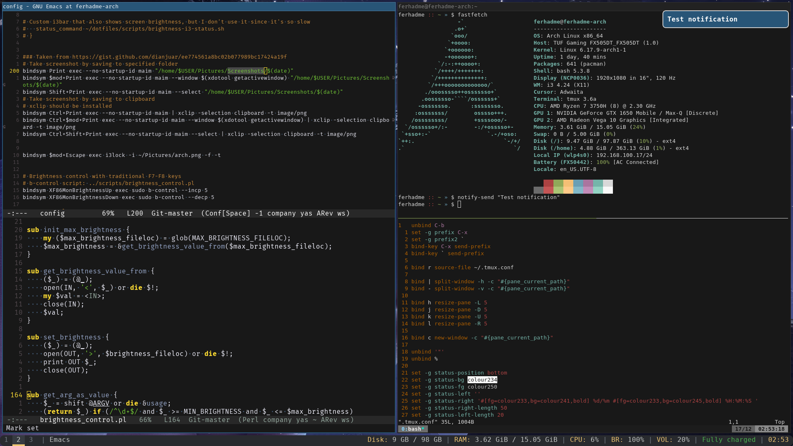

# Dotfiles

### About
Configuration files for a minimalistic Arch Linux desktop environment optimized for keyboard-driven workflows, speed, and minimal RAM/CPU usage.

On a typical daily workload (text editors, browser, terminal, media players) on a `16 GB` RAM system with an `8-core` AMD Ryzen 7 CPU, this setup uses `<4 GB` RAM and `~1%` CPU. In an idle state, memory usage stays below `2GB`, with CPU usage below `10%`.



### Overview

#### Editors

**`.doom.d`** - Doom Emacs configuration

**`.vanilla.emacs.d`** - Plain Emacs configuration

**`.edwin.d`** - Edwin text editor configuration

**`.vimrc`** - Very minimal Vim setup

**`.ideavimrc`** - Intellij IDEA Vim plugin configuration (loads .vimrc)

#### Window Manager & UI

**`i3`** - Tiling X11 window manager 

**`i3status`** - Lightweight i3status bar

**`polybar`** - i3 compatible status bar. Better than i3status for its flexibility and customizability

**`picom`** - Lightweight X11 compositor for using with i3 since it doesn't provide compositing

**`alacritty`** - GPU-accelerated terminal emulator

**`dunst`** - Customizable notification daemon

#### Shell & CLI

**`.bashrc`** - Bash shell configuration (aliases, PS1, exports, autocompletion)

**`.tmux.conf`** - Tmux terminal multiplexer keybindings and appearance

**`.gitconfig`** - Git configuration with bunch of useful aliases

**`.mongoshrc.js`** - MongoDB client shell startup configuration

**`.psqlrc`** - PostgreSQL client configuration

#### X11 & Input

**`.Xmodmap`** - Swaps Caps Lock and Left Ctrl on Xorg keyboard layout

**`.xprofile`** - X user session initializer

#### Scripts

**`scripts/brightness-i3-status.sh`** - Workaround script for displaying brightness on i3status bar, since i3status doesn't have brightness module. Used in i3status configuration file

**`scripts/brightness_control.pl`** - Perl script for changing brightness of screen by modifying state of Kernel `/sys/class/backlight module`. It handles value and percentage based brightness changes well. Used in polybar, i3 configuration files

**`scripts/fan-control.pl`** - Perl script for controlling fan mode (silent, balance, turbo) by modifying state of Kernel `asus-nb-wmi module` on Asus laptops. Used in polybar, i3 configuration files

**`scripts/emacs-profile.sh`** - Switch between different Emacs profiles (Doom Emacs, Vanilla Emacs)

**`scripts/launch-polybar.sh`** - Shell script for launching polybar on i3 startup

**`scripts/run-maven-archetype-quickstart.sh`** - Shell script I'm using compile and run maven archetype quickstart java apps

**`scripts/suspend-i3.sh`** - Shell script for sleeping computer by using i3lock and `/sys/power/state` module, since i3 doesn't provide built-in sleep option

**`scripts/xmodmap_start.sh`** - Workaround shell script for loading .Xmodmap file on i3 login

#### Other

**`touchegg`** - Multi touch gestures configuration file for GNOME. I'm not using this anymore though because of heavy GNOME dependencies


### Installation
**This script will delete existing configuration files and replace them with symlinks from this repository.**

### Notes
- Probably will not work if you're using Wayland display server
- Some scripts require root access or specific hardware (e.g., ASUS laptops)

```sh
curl https://raw.githubusercontent.com/ferhadme/dotfiles/refs/heads/master/install.sh | sh
```
